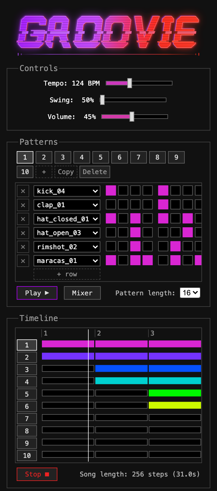

# Groovie

Free, open source drum/beat sequencer that runs in your browser. No ads, no account
required, nothing to install. Written in pure JavaScript with no frameworks and
no backend. It works on desktop, tablets and mobile phones.

**Try it out: https://maximecb.github.io/groovie/**


The same project on a phone. The grid scrolls sideways and the mix controls move
behind a button, so a pattern is edited the same way on either:




Sketch a beat in the step sequencer, then arrange your patterns into a song on the
timeline below it. When it sounds right, hit "Copy link": the whole project is encoded
into the hash portion of the URL, so anyone you send the link to can play it and remix
it. Nothing is uploaded anywhere, and there is nothing to sign up for.

I hope this can be a valuable tool for teaching people about rhythm and music
production, and a fun one for enthusiasts to sketch ideas with. If you think this
project is cool and you want to support my open source work, you can
[sponsor me on GitHub](https://github.com/sponsors/maximecb).

## Examples

Each of these links is the whole piece. There is nothing behind them: open one and
you can play it, take it apart and remix it.

- [The amen break](https://maximecb.github.io/groovie/#the_amen_break/BgBA_MEUQOLAXGGsElCXs4a1qAwaDUHg) —
  the most sampled break there is, laid onto a grid, and about as much as one pattern holds.
- [A drum and bass roller](https://maximecb.github.io/groovie/#a_drum_and_bass_roller/CGBA_UEUQOGFYCACdworVFVTqa7b-LPECCQoBEIEkhxrqBB24h1oAghrDTnpAA) —
  two-step at 174, with rimshots standing in for ghost notes and the hats opening
  into sixteenths for the last half bar.
- [A house groove, panned wide](https://maximecb.github.io/groovie/#a_32_bar_house_groove_panned_wide/BUNDfUOBjgQQR4kZyAh8BDkCAHAQwIJT60SsfbvgRgn6RHH79-4ihH_Fj6AQQRwnEjMLyAh8BK0gQFgeYEEp-JUHmORQAWO5EBWNpBCWBCPFfqSA) —
  32 bars with the kit spread across the stereo field, and a light shuffle on the
  sixteenths that leaves the four to the floor where it is.
- [A dub techno arrangement](https://maximecb.github.io/groovie/#a_dub_techno_arrangement/BUAngZ5BwMcKBIZWBBBBjG-w8BZTKvPWY4uw8RKRwRJsDUWQQSxL2LkPGjHE5IlRPMxTwA) —
  built around the delay, a dotted eighth fed by a rimshot and a metallic stab
  played sparsely enough to leave the repeats room.
- [A drill and bass arrangement](https://maximecb.github.io/groovie/#a_64_bar_drill_and_bass_arrangement/B9ATI_5htYoCCAImhWOL9cICQhhNTEuGBTQszLjv36cmILUJCQERFJMkCIK1qWpZ-eQCgiBBCRRAjjXAiCRSCAVFZjaWhcFV2e_nsVIbBIiCQkxIJRQiixxLEl4iJICCKCBFyOSZT1ASSGk0JiFx1q0misRcCIgTmdSiU0mRsgG8UlIoZ5wGwIiBCCCgi0YBjCOtVLx8hn4rr77_NYTG6rBEgQESKApNnvpKr_LPLPE4j6kA8Ag2ASR0iZrn2IlYuQflAFNAC5AiCT0VQxEhEz9UsA) —
  64 bars across eight patterns at 165, the longest and busiest of these, and the
  one that pushes the encoding hardest at 354 characters.

## Features

Free-running polymeters. Steps have a fixed duration rather than a fixed number per
pattern, so a 15-step pattern and a 16-step one drift against each other and only line
up again much later. Odd pattern lengths give you grooves that keep evolving instead of
resetting every bar.

- Patterns of 1 to 64 steps and up to 16 rows, up to 64 patterns per project
- Over 150 public domain (CC0) samples: kicks, snares, hats, toms, percussion and
  cymbals, plus vocals, game sounds and assorted noise
- Per-row sample, stereo panning, level in dB and delay send
- A tempo-synced delay set in fractions of a step, from slapback up to a full bar
- Tempo from 40 to 280 BPM, plus a swing control
- Patterns can be switched while the music plays: the one you pick is queued and
  launches when the playing one comes around, the way a groovebox does it
- Works on desktop, tablets and phones

## Running it locally

Clone the repo and start a local HTTP server as follows:

```sh
git clone https://github.com/maximecb/groovie.git
cd groovie
./tools/dev_server.py
```

Then open http://localhost:8001. Nothing to install or build, but the page does
have to be served over HTTP: it loads as an ES module and fetches its samples,
which browsers block on `file://`. The server needs Python 3 and sends no-cache
headers, so a reload always picks up your last edit.

## Contributing

The code is distributed under an MIT license, while the samples are under a CC0 license.

We could use more high quality samples. These should be in 44.1KHz 16-bit mono PCM wav format,
and they have to be available under the CC0 license (public domain). We cannot include
copyrighted samples.
You can run `tools/convert_samples.sh` to convert new samples to the expected format,
which the CI will check.

### Codebase overview

Plain ES modules, no build step and no dependencies. `index.html` loads `main.js`,
which pulls in the other three.

| | |
|---|---|
| `model.js` | The project itself: patterns, rows, the timeline, and the URL encoding a link is made of. Knows nothing about the DOM or about audio. |
| `audio.js` | The sample library and the Web Audio graph, including the scheduler that decides what plays when. |
| `view.js` | Renders the pattern grid and the timeline. The views are a function of the model: rendering reads project state and never writes it. |
| `main.js` | The wiring. Controls, buttons, keyboard, and keeping the link in the address bar in step with the project. |
| `sample_list.js` | Generated map of sample paths to indices. Rebuilt by `tools/update_samples.py`, not edited by hand. |

A sample index is permanent once it has been used in a shared link, which is why
that map is generated rather than sorted on the fly.

`tests/corpus.js` holds the songs the encoding is exercised and measured on, and is
kept apart from the tests because two things use it: the tests round-trip the songs,
and `tools/link_sizes.js` reports what each one costs as a link. A change to the
encoding is judged on what it does to that table. `design.md` covers the decisions
behind the model and the URL scheme.

### Running the tests

There is nothing to install. The tests run on the test runner built into Node,
and need Node 22 or later:

```sh
./tools/run_tests.sh
```

The tests cover the project model and the URL encoding in `model.js`, and the
sample library in `audio.js`. Playback and the DOM are not covered, since they
need a browser.

Note that the model states its preconditions with `console.assert`, which only
prints a message in the browser rather than stopping anything. `tests/setup.js`
makes those count as test failures, and `tools/run_tests.sh` loads it ahead of
every test file, so run the tests through that script rather than calling
`node --test` directly.

`tests/encoding.test.js` holds a few golden links. A shared link has to keep
opening as the project it was made from, so a failure there means that
already-shared links now decode differently.

The CI also runs two checks you can run yourself:

```sh
./tools/check_js.sh        # every .js file parses as an ES module
python3 tools/check_samples.py   # sample format, and sample_list.js against the samples
```
